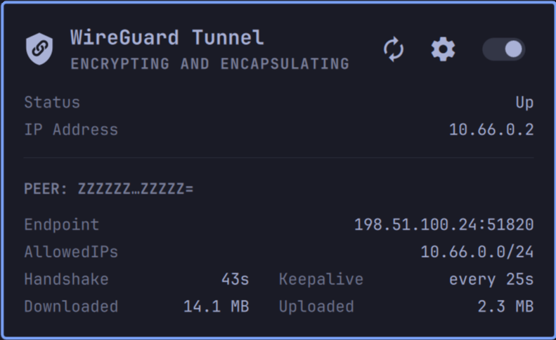

# WireGuard



An Omarchy bar widget for a single WireGuard interface, `wg0`.

- A shield in the bar shows the tunnel state: filled while up, outlined
  otherwise. It turns urgent on any error, including an expired peer
  handshake.
- The panel toggles the tunnel and shows its address and per-peer details:
  endpoint, allowed IPs, latest handshake, transfer and keepalive.
- If something outside the plugin (NetworkManager, a systemd unit, a terminal)
  takes the tunnel down, you get a critical notification. Click it to bring
  the tunnel back up.
- If a peer's last handshake gets older than a threshold (135 s by default),
  the panel shows an error and you get one notification. A peer that has not
  shaken hands at all counts once the tunnel has been up for that long.
- Every failed command raises a notification and shows in the panel's error
  card, quoting the command and how it ended, e.g.
  ``Failed running: `sudo -n /usr/bin/wg-quick up wg0` (exit 1)``. Run the
  command in a terminal for the full output. A failed toggle's error clears
  once the tunnel is seen in the state it was after, e.g. brought up by hand.

The interface name `wg0` and the config path `/etc/wireguard/wg0.conf` are
fixed.

> [!NOTE]
> The plugin reports; it is not a kill switch. Traffic is not blocked while
> the tunnel is down. After a shell restart, the drop alarm is only armed once
> the plugin has seen the tunnel up.

## Requirements

- `wireguard-tools` (`wg`, `wg-quick`) and `iproute2` (`ip`):

  ```sh
  yay -S wireguard-tools iproute2
  ```

- A working `/etc/wireguard/wg0.conf`.
- A passwordless sudo rule for exactly the commands the plugin runs.
- `wl-clipboard` (`wl-copy`) for the click-to-copy values; Omarchy ships it.

### sudoers

Status is read with `ip`, which needs no root. Toggling and peer details need
root, so the plugin calls `sudo -n` (non-interactive: it never prompts) with
absolute paths. Grant only those commands:

```sh
echo "$(id -un) ALL=(root) NOPASSWD: /usr/bin/wg-quick up wg0, /usr/bin/wg-quick down wg0, /usr/bin/wg show wg0 peers, /usr/bin/wg show wg0 endpoints, /usr/bin/wg show wg0 allowed-ips, /usr/bin/wg show wg0 latest-handshakes, /usr/bin/wg show wg0 transfer, /usr/bin/wg show wg0 persistent-keepalive" \
  | sudo tee /etc/sudoers.d/omarchy-bar-plugin-wireguard-wg0
sudo chmod 0440 /etc/sudoers.d/omarchy-bar-plugin-wireguard-wg0
sudo visudo -c
```

> [!WARNING]
> This lets your user run the listed commands as root without a password.
> Review the file and the `visudo -c` output.

None of the `wg show` fields above include private or preshared keys. Check
the setup by running every command in the rule yourself, starting with the
tunnel down. None of them should prompt for a password:

```sh
sudo -n /usr/bin/wg-quick up wg0
sudo -n /usr/bin/wg show wg0 peers
sudo -n /usr/bin/wg show wg0 endpoints
sudo -n /usr/bin/wg show wg0 allowed-ips
sudo -n /usr/bin/wg show wg0 latest-handshakes
sudo -n /usr/bin/wg show wg0 transfer
sudo -n /usr/bin/wg show wg0 persistent-keepalive
sudo -n /usr/bin/wg-quick down wg0
ip -j addr show dev wg0
```

`sudo: a password is required` means that command is missing from the rule.
The last line needs no sudo; with the tunnel down it prints
`Device "wg0" does not exist.`

## Install

```sh
omarchy plugin add https://github.com/justfortheloveof/omarchy-bar-plugin-wireguard-wg0.git --enable --yes
omarchy restart shell
```

## Update

```sh
omarchy plugin update io.github.justfortheloveof.wireguard-wg0 --yes
omarchy restart shell
```

## Remove

```sh
omarchy plugin remove io.github.justfortheloveof.wireguard-wg0 --yes
omarchy restart shell
sudo rm /etc/sudoers.d/omarchy-bar-plugin-wireguard-wg0
```

The plugin writes nothing else: its settings live on the widget's bar entry in
`~/.config/omarchy/shell.json` and go with it. Removing the plugin does not
touch the tunnel or `/etc/wireguard/wg0.conf`; a tunnel that is up stays up.

## Usage

Left-click the shield to open the panel.

| Input | Action |
| --- | --- |
| Toggle switch, `t` | Bring the tunnel up or down |
| `󰁪` button, `r` | Refresh now |
| `󰒓` button, `s` or `c` | Show or hide the settings |
| `←` / `→`, `h` / `l` | Move between the refresh button, the settings button and the switch |
| `↑` / `↓`, `k` / `j` | Scroll the details, or move between the settings rows |
| `Enter`, `Space` | Press the highlighted button, switch or setting |
| `Esc` | Leave the settings, or close |

The highlight appears with the first arrow or `hjkl` press, so `Enter` does
nothing until then.

Click the IP address, an endpoint or the allowed IPs to copy them. Click a
`PEER:` header to copy that peer's full public key.

The tunnel is polled every 10 seconds by default (see [Settings](#settings)),
whether or not the panel is open. With the tunnel down that is one
unprivileged `ip` call; while it is up, six `sudo -n wg show` field queries
follow. A poll that takes longer than the interval is never stacked: timer
ticks that land while it runs are skipped.

The toggle only acts from a confirmed up or down state. It is disabled while
checking or in error. One such error is an existing `wg0` whose link is down
(for example after `ip link set wg0 down`). `wg-quick up` cannot fix that, so
the plugin reports it and leaves it to you.

## Settings

The settings view (`󰒓`, `s` or `c`) replaces the details below the panel
header. Changes are saved at once, on the widget's entry in
`~/.config/omarchy/shell.json`, so they survive restarts and plugin updates.
They are lost if the widget is removed from the bar.

| Setting | Key | Default |
| --- | --- | --- |
| Error and notify on external down | `notifyExternalDrop` | `true` |
| Error on expired handshake | `handshakeError` | `true` |
| Expired handshake threshold (seconds, 120 to 86400) | `handshakeStaleAfterSec` | `135` |
| Poll interval (seconds, 1 to 3600) | `pollIntervalSec` | `10` |

With `notifyExternalDrop` off, an outside drop is shown as a plain down: no
error, no notification. With `handshakeError` off, a stale handshake is not
shown at all.

In the settings view, `Enter` or `Space` flips a switch. On a number,
`Enter` starts editing; `Enter` again saves and `Esc` cancels. Values outside
the range are clamped to it.

The same keys can be set from a terminal:

```sh
omarchy bar set io.github.justfortheloveof.wireguard-wg0 handshakeStaleAfterSec 300
omarchy bar set io.github.justfortheloveof.wireguard-wg0 notifyExternalDrop false
omarchy bar set io.github.justfortheloveof.wireguard-wg0 pollIntervalSec 1
```

> [!NOTE]
> The poll interval applies to the peer details too. While the tunnel is up,
> every poll runs six `sudo` calls, and with the default PAM setup each one
> writes about three lines to the journal: roughly 150k lines a day at 10 s,
> 1.5M at 1 s. With the tunnel down, a poll is one `ip` call and no `sudo`.

> [!NOTE]
> WireGuard peers only exchange handshakes when there is traffic, or every
> `PersistentKeepalive` seconds if that is set. A healthy but idle peer with no
> keepalive (the panel's "Keepalive" row reads "off") will go past the
> threshold. Set a keepalive on that peer, raise the threshold, or turn
> `handshakeError` off.

## Notifications

Notifications go through `omarchy-notification-send`, deduplicated per
problem: a failure that repeats every poll notifies once, and again only after
it has recovered. Failures are normal urgency. An expired handshake notifies
once until every peer is fresh again, the tunnel goes down, or
`handshakeError` is turned off. An outside drop is critical and stays until
dismissed; clicking it runs:

```sh
/usr/share/omarchy/bin/omarchy-shell io.github.justfortheloveof.wireguard-wg0 bringUp
```

`bringUp` does nothing unless the tunnel is confirmed down and idle, so an old
toast is harmless.

## More

- [docs/ARCHITECTURE.md](docs/ARCHITECTURE.md): the polling state machine.
- [docs/CONTRIBUTING.md](docs/CONTRIBUTING.md): development loop and tests.

## License

MIT, see [LICENSE](LICENSE).
