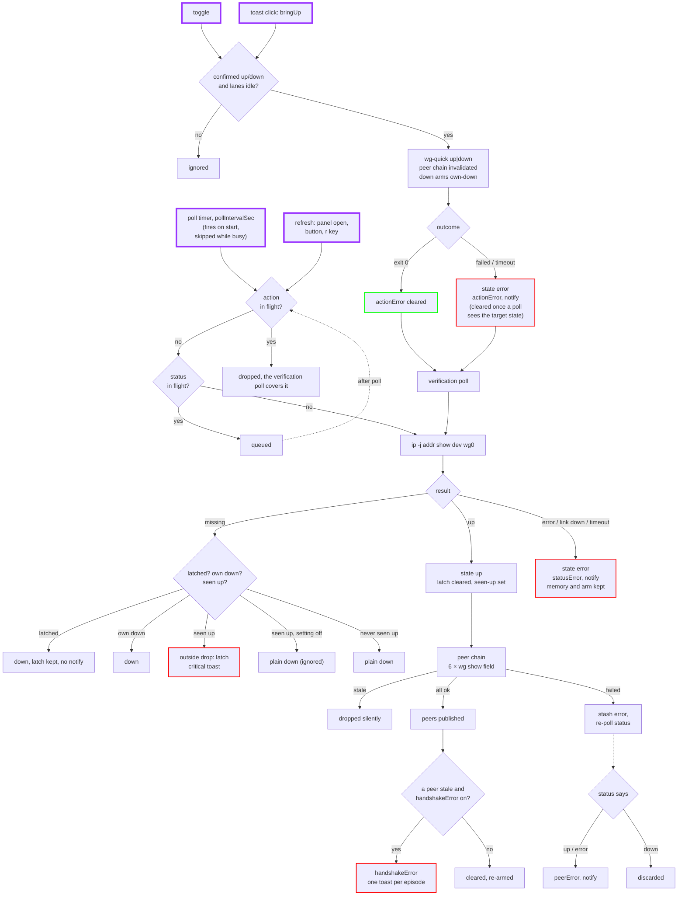

# Architecture

## Files

| File | Role |
| --- | --- |
| `manifest.json` | Declares a `service` (`Service.qml`) and a `bar-widget` (`Panel.qml`). |
| `Service.qml` | Host-wide singleton. Owns all polling, toggling, error state and notifications. |
| `Panel.qml` | Bar icon and popup panel. Renders the service's properties; holds no tunnel state. Owns the settings view and saves settings. |
| `CommandProcess.qml` | One-shot command runner with a watchdog (SIGTERM, then SIGKILL after 2 s). |
| `Model.js` | Pure functions: parsing, classification, formatting. Unit tested with node. |

The shell creates one `Service.qml` instance while the widget is in the bar and
destroys it when the widget is removed. `keepLoaded` is `false`, so a plugin
update or shell reload always runs fresh service code. The cost is a brief
"checking" state, since all state can be read again in one poll.

## Lanes

The service runs three command lanes, each a `CommandProcess`:

| Lane | Command | Watchdog |
| --- | --- | --- |
| status | `/usr/bin/ip -j addr show dev wg0` | 4 s |
| action | `sudo -n /usr/bin/wg-quick up\|down wg0` | 10 s |
| peers | `sudo -n /usr/bin/wg show wg0 <field>`, six fields in sequence | 4 s each |

Every command runs as `/usr/bin/env LC_ALL=C <absolute path> ...`, so the
English stderr match in `Model.statusState` does not depend on the user's
locale, and `sudo`'s `secure_path` cannot redirect a binary.

Rules:

- **Status never overlaps an action.** A refresh requested during an action is
  dropped. The action's completion always runs a verification poll, so the
  state after a toggle is confirmed by `ip`, not assumed.
- **Timer ticks never queue.** The poll timer runs every `pollIntervalSec`
  (a setting, 1 to 3600 s); a tick that finds the status or action lane busy
  is skipped, so a poll slower than the interval cannot make polls run back to
  back. When the setting changes to a shorter interval that has already
  elapsed since the last poll, it polls at once. The peer chain starts from
  each `up` poll and is skipped while the previous chain is still running.
- **A manual refresh during a status poll is kept**, not dropped: it sets one
  flag and runs a single poll when that poll lands, however many refreshes
  arrived.
- **An action starts only from a confirmed `up` or `down`** with both the
  status and action lanes idle.
- **The peer chain runs only while `up` with no action in flight.** Anything
  that makes an in-flight chain stale (toggle accepted, tunnel left `up`, chain
  failure) bumps a generation counter, and late results are dropped silently.

## Status classification

`Model.statusState` maps one `ip` result to a state:

| `ip` result | State |
| --- | --- |
| exit 0, one `wg0` entry with the `UP` flag | `up` |
| exit non-zero, stderr "does not exist" | `down` (what `wg-quick down` leaves) |
| exit 0, `wg0` without `UP` | `error`: "Interface \`wg0\` exists but its link is down" |
| exit 0, unparseable or unexpected payload | `error`: "... (exit 0): unreadable output" |
| any other failure, or the watchdog | `error`, quoting the command |

An `error` poll says nothing about the tunnel itself, so it changes neither the
drop memory nor a pending own-down (below). It does clear the peer list: the
peers are gone with a tunnel it could not confirm.

## Outside drops

A `down` is reported as an outside drop when:

1. this service instance saw the tunnel `up` since the last classified down, and
2. no down started by the plugin is pending, and
3. no drop is already latched.

`down()` arms the own-down expectation when the command starts, not when it
succeeds, so a failed or timed-out down is never blamed on something else. The
poll that confirms the down consumes it.

With the `notifyExternalDrop` setting off, such a down is classified
`ignored`: it consumes the up memory like a drop but does not latch, show an
error or notify. Turning the setting off clears a drop already latched.

A drop latches: the state stays `down` (so the toggle still works), the icon
and status row turn urgent, the error card explains, and one critical toast is
sent. The latch clears when `ip` sees the interface up again, or when the
`notifyExternalDrop` setting is turned off.

The memory lives in the running process only. A tunnel that is already down
when the service starts is a plain `down`.

## Peer details

The chain queries `peers`, `endpoints`, `allowed-ips`, `latest-handshakes`,
`transfer` and `persistent-keepalive`, one field per call, so no output ever
contains a private or preshared key. `Model.buildPeers` merges the tables by
public key.

A failed step is not reported right away. The chain aborts, the error is
stashed, and a status poll runs:

- tunnel now `down`: the failure was caused by the drop, so it is discarded;
- tunnel `up`, or status unreadable: the failure is reported in `peerError`.

The last good peer list stays on screen while a peer error is shown.

## Expired handshakes

Each peer record carries its raw `handshakeEpoch` and a `handshakeStale` flag:
the handshake is older than `handshakeStaleAfterSec`, or it never completed
and the tunnel has been up for longer than that. Right after an up no peer
has had the chance to shake hands, so a `0` handshake is not flagged until
then. The up time is when this instance first saw the tunnel up since the last
down; an error poll keeps it. A threshold change between polls recomputes the
flags (`Model.restalePeers`).

With `handshakeError` on, `handshakeError` names the stale peers after every
peer build. The text does not include the age, so it does not change from
poll to poll. It is one notification per episode: the `handshake` channel is
re-armed only when peers are present and none is stale, when the tunnel goes
down, or when the setting is turned off. An empty peer list (status error,
chain reset) neither raises nor re-arms it. The tunnel state and the toggle
are not affected.

## Settings

The shell stores a widget's settings inline on its bar entry in
`~/.config/omarchy/shell.json` and hands them to the widget as `settings`,
never to the service. `Panel.qml` normalizes them (`Model.normalizePrefs`:
CLI strings coerced, integers clamped, anything else falls back to the
default) and pushes them into the service with `applyPrefs`, which ignores an
unchanged value, so one bar per monitor costs one update. Saving merges the
change into the existing entry and calls `bar.shell.updateEntryInline`.
`manifest.json`'s `barWidget.defaults` mirrors `Model.PREF_DEFAULTS`; a unit
test keeps them equal.

## Errors and notifications

Each lane has its own error property (`actionError`, `statusError`,
`peerError`), cleared by that lane's own success, plus the derived
`handshakeError`. A few other events clear one too:

- `actionError`: a status poll that confirms the state the failed action was
  after (for example a failed `up`, then the tunnel brought up by hand);
- `peerError`: a `down` poll, since the peers are gone with the tunnel;
- the outside-drop message in `statusError`: turning `notifyExternalDrop` off.

The panel shows the highest-priority one: action, then status, then peer,
then handshake.

Notifications are deduplicated per channel (`action`, `status` for the
outside drop, `statuserr` for `ip` failures, `peer`, `handshake`). A channel
stays silent while its message repeats, and is re-armed when it recovers, so
a failure that repeats every poll notifies once. Any readable poll re-arms
`statuserr`, even while an outside drop stays latched.

Notifications use `omarchy-notification-send` rather than `notify-send`. The
drop toast's click action is an `--exec` argv
(`omarchy-shell <plugin id> bringUp`) that the shell runs after the sender has
exited; a libnotify action would die with the sending process. The shell's
notification card draws no buttons, so the toast text itself says
"Click to bring it back up."

## Flow

